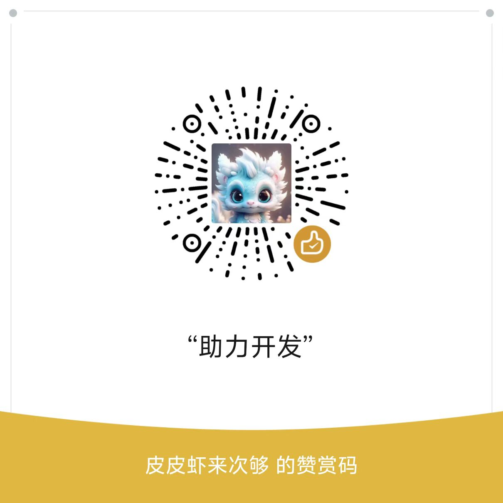

# qlist 知识付费网盘
本项目为知识付费网盘，基于 Alist 开发，可以配置下载积分、下载价格。
> 本项目代码由 GPT-4.1 模型参与优化设计，在此感谢感谢。

## 数据驱动
- [x] MySql
- [x] MongoDB
- [x] SqlLite

## 登陆支持
- [x] 微信
- [x] Google
- [x] Gtihub

## 赞助 & 有偿技术服务

  
  

